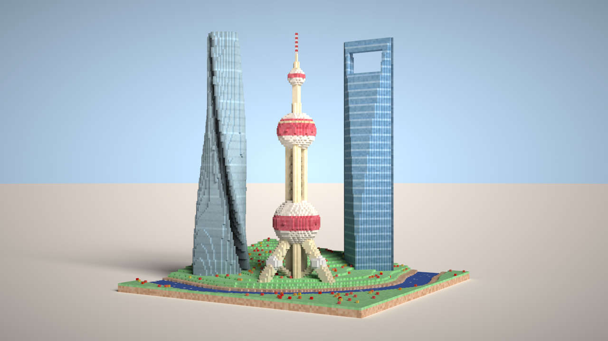

# <a name="title">Taichi Voxel Challenge - SuperSodaSea's work</a>

<p align="center">
</img>
<br>
<a href="https://github.com/SuperSodaSea/voxel-challenge-alpha/blob/main/diamond_ore.py">Diamond Ore</a>
</p>
<p align="center">
</img>
<br>
<a href="https://github.com/SuperSodaSea/voxel-challenge-alpha/blob/main/shanghai.py">Shanghai</a>
</p>

---

## About Taichi Voxel Challenge

Visit https://github.com/taichi-dev/voxel-challenge for more information.

## Installation

Make sure your `pip` is up-to-date:

```bash
pip3 install pip --upgrade
```

Assume you have a Python 3 environment, simply run:

```bash
pip3 install -r requirements.txt
```

to install the dependencies of the voxel renderer.

## Quickstart

Mouse and keyboard interface:

+ Drag with your left mouse button to rotate the camera.
+ Press `W/A/S/D/Q/E` to move the camera.
+ Press `P` to save a screenshot.
